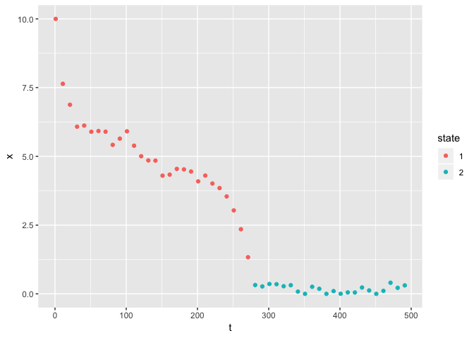
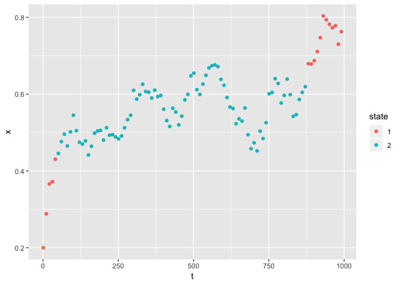
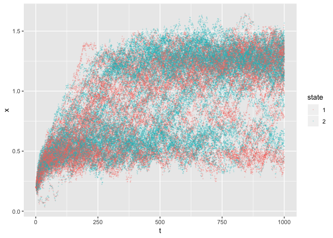

``` r
knitr::opts_chunk$set(message=FALSE)
```

``` r
library(depmixS4)
library(tidyverse)
library(here)
```

Let’s write this as a function:

``` r
#construct the HMM based on Chen et al 2016

hmm <- function(observations){
  mod <- depmix(x~1,data=observations,nstates=2,trstart=runif(4),instart=c(1,0))
  fm <- fit(mod)
  results <- fm@posterior
  results$state <- as.character(results$state)
  bind_cols(observations, results) 
}
```

Looks like results can vary with seed, so we better keep that fixed.

``` r
set.seed(12345)
```

## A few examples series:

``` r
read.csv(paste(here::here(),"/data/example_jae2.csv",sep="")) %>% 
  hmm() %>% 
  ggplot(aes(t,x, col=state)) + geom_point()
```

    ## iteration 0 logLik: -119.5317 
    ## iteration 5 logLik: -80.46287 
    ## converged at iteration 10 with logLik: -44.15001

<!-- -->

``` r
read.csv(paste(here::here(),"/data/example_cb1.csv",sep=""))%>% 
  hmm() %>% 
  ggplot(aes(t,x, col=state)) + geom_point()
```

    ## iteration 0 logLik: 90.51646 
    ## iteration 5 logLik: 108.705 
    ## iteration 10 logLik: 108.7248 
    ## converged at iteration 11 with logLik: 108.7248

<!-- -->

# Many replicates

Let’s see what we get if we classify 100 replicates all simulated from
the same
process:

``` r
many_observations <- read_csv(paste(here::here(),"/data/reps.csv",sep=""))

## group_by + group_map is just a nice way to apply this function to each replicate:
df <- many_observations %>% 
  group_by(reps) %>% 
  group_map(~ hmm(.x), keep=TRUE) %>% 
  bind_rows()
```

Cool, let’s put them all together to see what it looks like:

``` r
df  %>% 
  ggplot(aes(t,x, col=state, group=reps)) + geom_point(alpha=0.2, size=0.1)
```

<!-- -->
