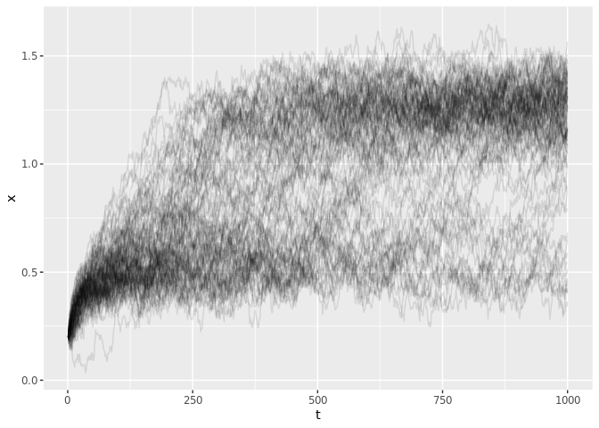
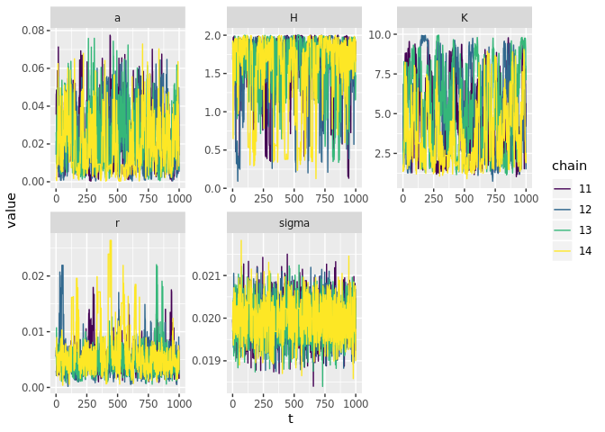
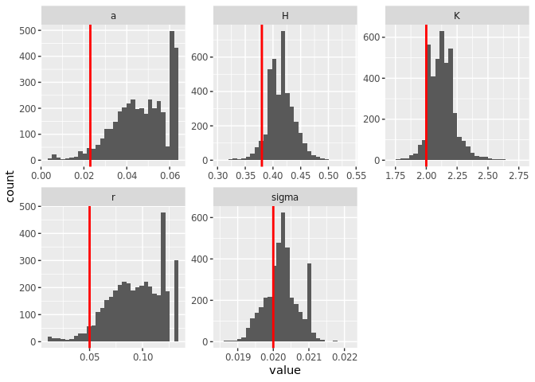

greta.Rmd
================
Carl Boettiger
5/30/2019

``` r
library(tidyverse)
library(greta) # remotes::install_github("greta-dev/greta")
Sys.setenv("CUDA_VISIBLE_DEVICES" = -1)   # Disable GPU
set.seed(123456)
```

``` r
data <- read_csv("../data/reps.csv")
```

    ## Parsed with column specification:
    ## cols(
    ##   t = col_double(),
    ##   x = col_double(),
    ##   reps = col_double()
    ## )

``` r
data %>% ggplot(aes(t,x, group=reps)) + geom_line(alpha=0.1)
```

<!-- -->

``` r
wide <- data %>% spread(reps, x) %>% select(-t) %>% 
  select(2) %>% # which / how many reps we use
  as.matrix()
n <- dim(wide)[1]
```

``` r
x_t1 <- wide[-1,] # data$x[-1]
x_t <- wide[-n,] # data$x[-100]
dim(x_t)
```

    ## NULL

``` r
dim(x_t1)
```

    ## NULL

``` r
#tibble(x_t, x_t1) %>% ggplot(aes(x_t, x_t1)) + geom_point()
```

``` r
#r <- 0.05 
Q <- 5
#sigma <- 0.02
#a <- 0.0233
K <- uniform(0, 10)
H <- uniform(0,  2)
a <- uniform(0, 1)
r <- uniform(0, 1)
#Q <- uniform(0, 10)
sigma <- uniform(0, 1)


# Model
mean <- x_t + r * x_t * (1 - x_t / K) - a * x_t ^ Q / (x_t ^ Q + H ^ Q)
distribution(x_t1) <- normal(mean, sigma)
m <- model(K, a, H, sigma, r)
```

``` r
system.time({
  draws <- mcmc(m, n_samples = 1000, warmup = 3000, chains = 4, verbose = FALSE)
})
```

    ##    user  system elapsed 
    ##  92.003  17.660  38.563

``` r
summary(draws)
```

    ## 
    ## Iterations = 1:1000
    ## Thinning interval = 1 
    ## Number of chains = 4 
    ## Sample size per chain = 1000 
    ## 
    ## 1. Empirical mean and standard deviation for each variable,
    ##    plus standard error of the mean:
    ## 
    ##          Mean        SD  Naive SE Time-series SE
    ## K     2.11730 0.1110670 1.756e-03      7.580e-03
    ## a     0.04816 0.0132068 2.088e-04      1.443e-03
    ## H     0.41185 0.0252757 3.996e-04      1.936e-03
    ## sigma 0.02017 0.0005817 9.197e-06      9.197e-05
    ## r     0.09783 0.0280878 4.441e-04      3.212e-03
    ## 
    ## 2. Quantiles for each variable:
    ## 
    ##          2.5%     25%     50%     75%   97.5%
    ## K     1.94637 2.04079 2.10131 2.16656 2.37777
    ## a     0.01797 0.03942 0.04925 0.05998 0.06538
    ## H     0.36778 0.39478 0.40848 0.42761 0.46771
    ## sigma 0.01925 0.01977 0.02020 0.02058 0.02111
    ## r     0.03661 0.07805 0.09865 0.12555 0.13604

``` r
#bayesplot::mcmc_trace(draws)
```

``` r
samples <-  
  map_dfr(draws, 
          function(x) data.frame(x, t = 1:dim(x)[1]), 
          .id = "chain") %>% 
  gather(variable, value, -t, -chain)

samples %>%  
  ggplot(aes(t,value, col=chain, group=chain)) + 
  geom_line() +
  facet_wrap(~variable, scales = "free") + 
  scale_color_viridis_d()
```

<!-- -->

``` r
#Q = 5
true <- data.frame(a = 0.023, r = .05, K = 2, H = .38, sigma = .02) %>%
  gather(variable, value)
```

``` r
samples %>% ggplot() + 
  geom_histogram(aes(value), bins = 30)  +
  geom_vline(data = true, aes(xintercept = value), col = "red", lwd = 1) + 
  facet_wrap(~variable, scales = "free")
```

<!-- -->
