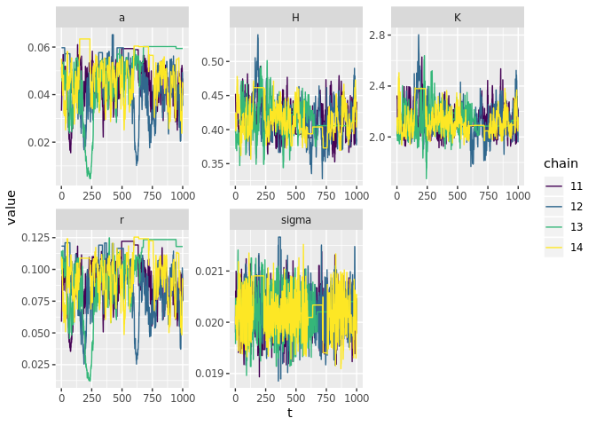

greta.Rmd
================
Carl Boettiger
5/30/2019

``` r
library(tidyverse)
library(greta) # remotes::install_github("greta-dev/greta")
set.seed(123456)
```

``` r
data <- read_csv("../data/reps.csv")
```

    ## Parsed with column specification:
    ## cols(
    ##   t = col_double(),
    ##   x = col_double(),
    ##   reps = col_double()
    ## )

``` r
data %>% ggplot(aes(t,x, group=reps)) + geom_line(alpha=0.1)
```

<!-- -->

``` r
wide <- data %>% spread(reps, x) %>% select(-t) %>% 
  # select(1:5) %>% # how many reps we use
  as.matrix()
n <- dim(wide)[1]
```

``` r
x_t1 <- wide[-1,] # data$x[-1]
x_t <- wide[-n,] # data$x[-100]
dim(x_t)
```

    ## [1] 999 100

``` r
dim(x_t1)
```

    ## [1] 999 100

``` r
#tibble(x_t, x_t1) %>% ggplot(aes(x_t, x_t1)) + geom_point()
```

``` r
#r <- 0.05 
Q <- 5
#sigma <- 0.02
#a <- 0.0233
K <- uniform(0, 10)
H <- uniform(0,  2)
a <- uniform(0, 1)
r <- uniform(0, 10)
#Q <- uniform(0, 10)
sigma <- uniform(0, 1)


# Model
mean <- x_t + r * x_t * (1 - x_t / K) - a * x_t ^ Q / (x_t ^ Q + H ^ Q)
distribution(x_t1) <- normal(mean, sigma)
m <- model(K, a, H, sigma, r)
```

``` r
system.time({
  draws <- mcmc(m, n_samples = 1000, warmup = 3000, chains = 4)
})
```

    ## 
    ## running 4 chains simultaneously on up to 16 cores

    ## 
        warmup                                           0/3000 | eta:  ?s          
        warmup =                                        50/3000 | eta:  5m          
        warmup =                                       100/3000 | eta:  4m          
        warmup ==                                      150/3000 | eta:  3m          
        warmup ===                                     200/3000 | eta:  3m          
        warmup ===                                     250/3000 | eta:  2m          
        warmup ====                                    300/3000 | eta:  2m          
        warmup ====                                    350/3000 | eta:  2m          
        warmup =====                                   400/3000 | eta:  2m          
        warmup ======                                  450/3000 | eta:  2m          
        warmup ======                                  500/3000 | eta:  2m          
        warmup =======                                 550/3000 | eta:  2m          
        warmup ========                                600/3000 | eta:  2m          
        warmup ========                                650/3000 | eta:  1m          
        warmup =========                               700/3000 | eta:  1m          
        warmup ==========                              750/3000 | eta:  1m          
        warmup ==========                              800/3000 | eta:  1m          
        warmup ===========                             850/3000 | eta:  1m          
        warmup ===========                             900/3000 | eta:  1m          
        warmup ============                            950/3000 | eta:  1m          
        warmup =============                          1000/3000 | eta:  1m          
        warmup =============                          1050/3000 | eta:  1m          
        warmup ==============                         1100/3000 | eta:  1m          
        warmup ===============                        1150/3000 | eta:  1m          
        warmup ===============                        1200/3000 | eta:  1m          
        warmup ================                       1250/3000 | eta:  1m          
        warmup ================                       1300/3000 | eta:  1m          
        warmup =================                      1350/3000 | eta:  1m          
        warmup ==================                     1400/3000 | eta:  1m          
        warmup ==================                     1450/3000 | eta:  1m          
        warmup ===================                    1500/3000 | eta:  1m          
        warmup ====================                   1550/3000 | eta: 49s          
        warmup ====================                   1600/3000 | eta: 47s          
        warmup =====================                  1650/3000 | eta: 45s          
        warmup ======================                 1700/3000 | eta: 44s          
        warmup ======================                 1750/3000 | eta: 42s          
        warmup =======================                1800/3000 | eta: 40s          
        warmup =======================                1850/3000 | eta: 38s          
        warmup ========================               1900/3000 | eta: 37s          
        warmup =========================              1950/3000 | eta: 35s          
        warmup =========================              2000/3000 | eta: 33s          
        warmup ==========================             2050/3000 | eta: 32s          
        warmup ===========================            2100/3000 | eta: 30s          
        warmup ===========================            2150/3000 | eta: 28s          
        warmup ============================           2200/3000 | eta: 27s          
        warmup ============================           2250/3000 | eta: 25s          
        warmup =============================          2300/3000 | eta: 23s          
        warmup ==============================         2350/3000 | eta: 21s          
        warmup ==============================         2400/3000 | eta: 20s          
        warmup ===============================        2450/3000 | eta: 18s          
        warmup ================================       2500/3000 | eta: 16s          
        warmup ================================       2550/3000 | eta: 15s          
        warmup =================================      2600/3000 | eta: 13s          
        warmup ==================================     2650/3000 | eta: 11s          
        warmup ==================================     2700/3000 | eta: 10s          
        warmup ===================================    2750/3000 | eta:  8s          
        warmup ===================================    2800/3000 | eta:  7s          
        warmup ====================================   2850/3000 | eta:  5s          
        warmup =====================================  2900/3000 | eta:  3s          
        warmup =====================================  2950/3000 | eta:  2s          
        warmup ====================================== 3000/3000 | eta:  0s          
    ## 
      sampling                                           0/1000 | eta:  ?s          
      sampling ==                                       50/1000 | eta: 35s          
      sampling ====                                    100/1000 | eta: 41s          
      sampling ======                                  150/1000 | eta: 32s          
      sampling ========                                200/1000 | eta: 30s          
      sampling ==========                              250/1000 | eta: 28s          
      sampling ===========                             300/1000 | eta: 25s          
      sampling =============                           350/1000 | eta: 23s          
      sampling ===============                         400/1000 | eta: 21s          
      sampling =================                       450/1000 | eta: 18s          
      sampling ===================                     500/1000 | eta: 17s          
      sampling =====================                   550/1000 | eta: 15s          
      sampling =======================                 600/1000 | eta: 14s          
      sampling =========================               650/1000 | eta: 12s          
      sampling ===========================             700/1000 | eta: 10s          
      sampling ============================            750/1000 | eta:  8s          
      sampling ==============================          800/1000 | eta:  6s          
      sampling ================================        850/1000 | eta:  5s          
      sampling ==================================      900/1000 | eta:  3s          
      sampling ====================================    950/1000 | eta:  2s          
      sampling ====================================== 1000/1000 | eta:  0s

    ##    user  system elapsed 
    ## 241.149  23.454 131.958

``` r
summary(draws)
```

    ## 
    ## Iterations = 1:1000
    ## Thinning interval = 1 
    ## Number of chains = 4 
    ## Sample size per chain = 1000 
    ## 
    ## 1. Empirical mean and standard deviation for each variable,
    ##    plus standard error of the mean:
    ## 
    ##           Mean        SD  Naive SE Time-series SE
    ## K     2.377414 9.926e-01 1.569e-02      3.791e-02
    ## a     0.015953 9.158e-03 1.448e-04      2.732e-04
    ## H     1.853113 8.069e-02 1.276e-03      8.372e-03
    ## sigma 0.020069 4.612e-05 7.293e-07      1.801e-06
    ## r     0.003648 1.433e-03 2.265e-05      4.819e-04
    ## 
    ## 2. Quantiles for each variable:
    ## 
    ##            2.5%      25%      50%      75%    97.5%
    ## K     1.2007307 1.665663 1.956015 2.806278 4.109700
    ## a     0.0010956 0.008410 0.017736 0.024010 0.025971
    ## H     1.6766729 1.811339 1.869534 1.919508 1.956462
    ## sigma 0.0199804 0.020037 0.020070 0.020100 0.020162
    ## r     0.0002593 0.003551 0.004071 0.004535 0.005325

``` r
#bayesplot::mcmc_trace(draws)
```

``` r
samples <-  
  map_dfr(draws, 
          function(x) data.frame(x, t = 1:dim(x)[1]), 
          .id = "chain") %>% 
  gather(variable, value, -t, -chain)

samples %>%  
  ggplot(aes(t,value, col=chain, group=chain)) + 
  geom_line() +
  facet_wrap(~variable, scales = "free") + 
  scale_color_viridis_d()
```

<!-- -->

``` r
#Q = 5
true <- data.frame(a = 0.023, r = .05, K = 2, H = .38, sigma = .02) %>%
  gather(variable, value)
```

``` r
samples %>% ggplot() + 
  geom_histogram(aes(value), bins = 30)  +
  geom_vline(data = true, aes(xintercept = value), col = "red", lwd = 1) + 
  facet_wrap(~variable, scales = "free")
```

<!-- -->
